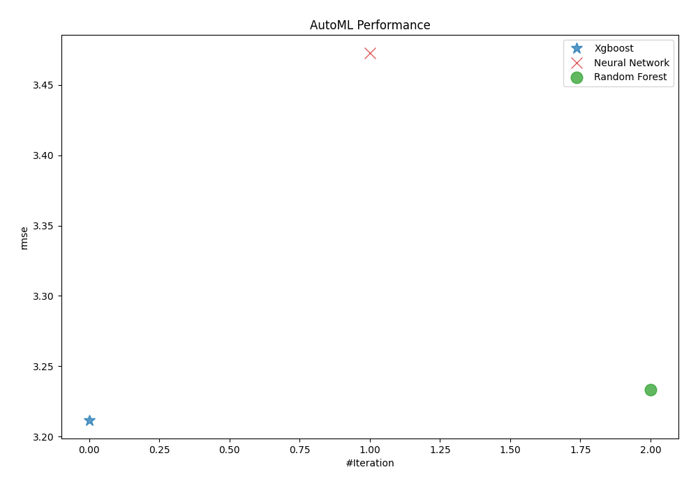
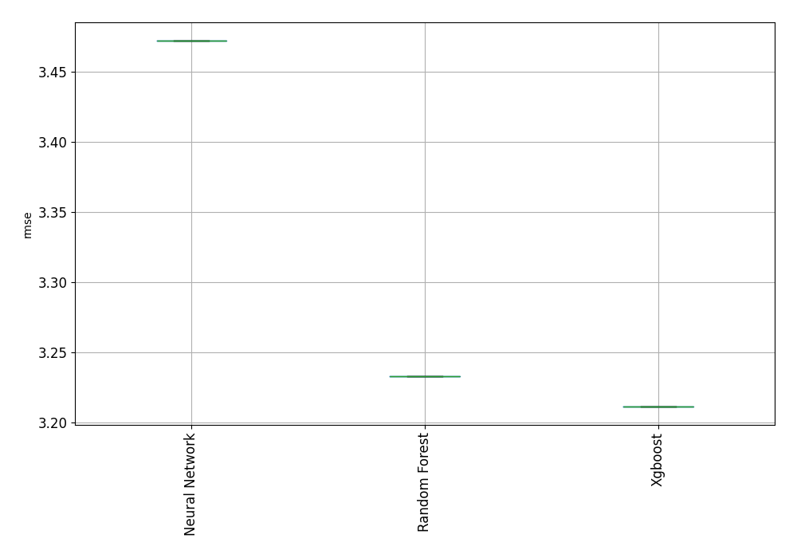
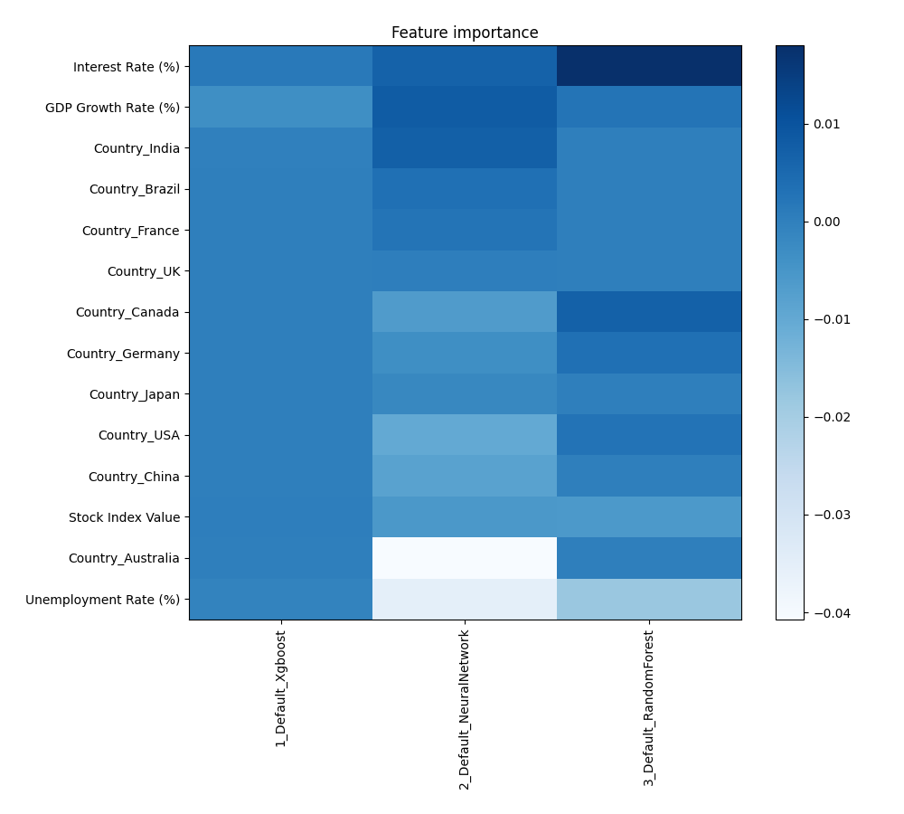
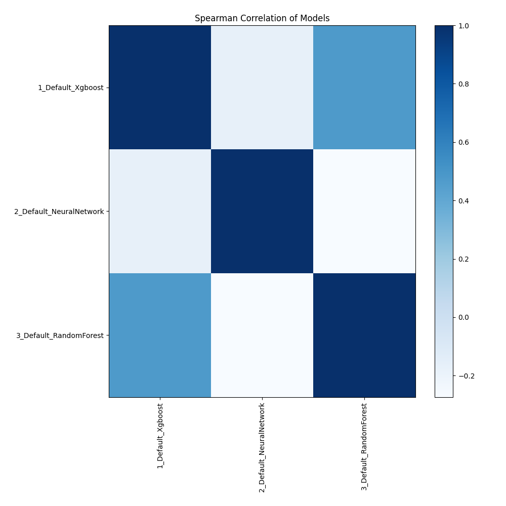

# AutoML Leaderboard

| Best model   | name                                                         | model_type     | metric_type   |   metric_value |   train_time |
|:-------------|:-------------------------------------------------------------|:---------------|:--------------|---------------:|-------------:|
| **the best** | [1_Default_Xgboost](1_Default_Xgboost/README.md)             | Xgboost        | rmse          |        3.21167 |         2.78 |
|              | [2_Default_NeuralNetwork](2_Default_NeuralNetwork/README.md) | Neural Network | rmse          |        3.47254 |         0.94 |
|              | [3_Default_RandomForest](3_Default_RandomForest/README.md)   | Random Forest  | rmse          |        3.23313 |         3.05 |

### AutoML Performance

### AutoML Performance Boxplot

### Features Importance

### Spearman Correlation of Models

