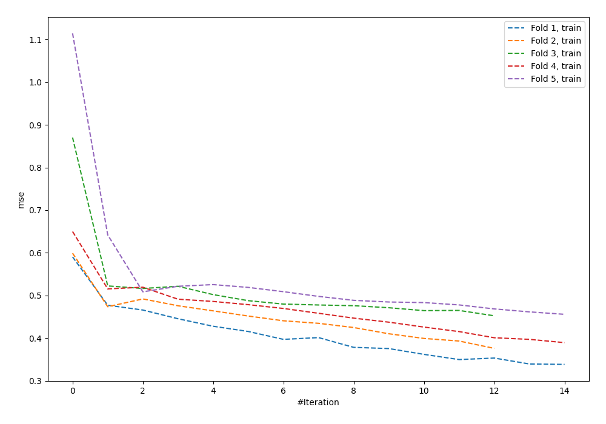
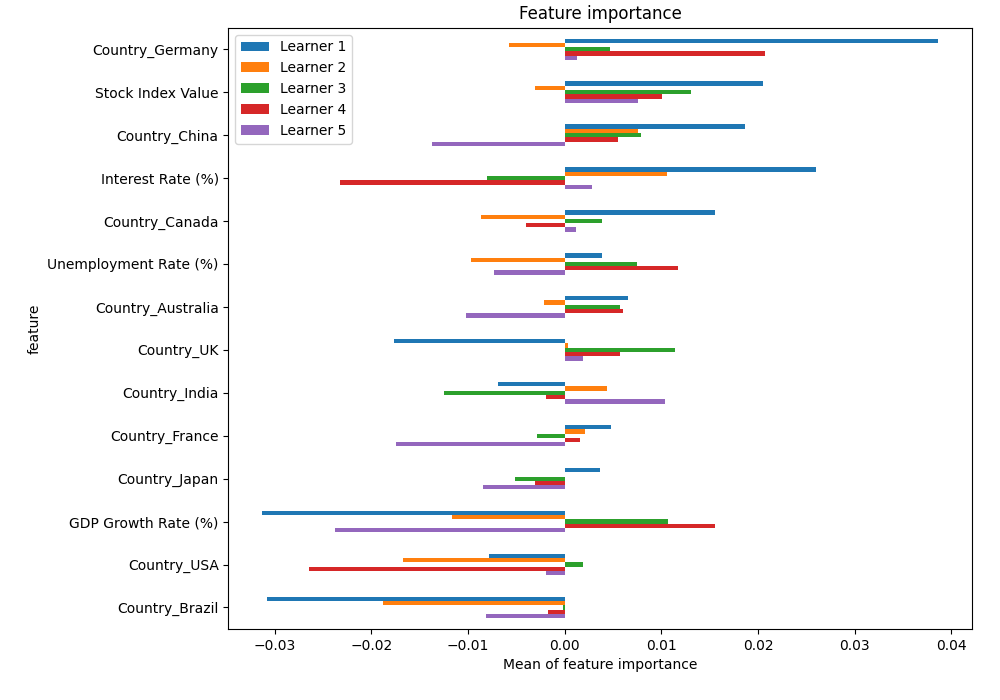
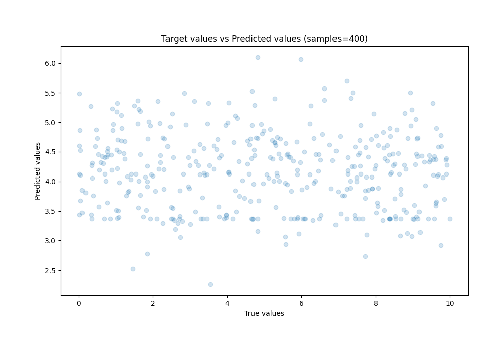

# Summary of 2_Default_NeuralNetwork

[<< Go back](../README.md)

## Neural Network
- **n_jobs**: -1
- **dense_1_size**: 32
- **dense_2_size**: 16
- **learning_rate**: 0.05
- **explain_level**: 2

## Validation
 - **validation_type**: kfold
 - **k_folds**: 5
 - **shuffle**: True

## Optimized metric
rmse

## Training time

1.8 seconds

### Metric details:
| Metric   |    Score |
|:---------|---------:|
| MAE      |  2.73837 |
| MSE      | 10.2816  |
| RMSE     |  3.20649 |
| R2       | -0.15791 |
| MAPE     |  6.73312 |

## Learning curves

## Permutation-based Importance

## True vs Predicted

## Predicted vs Residuals

[<< Go back](../README.md)
