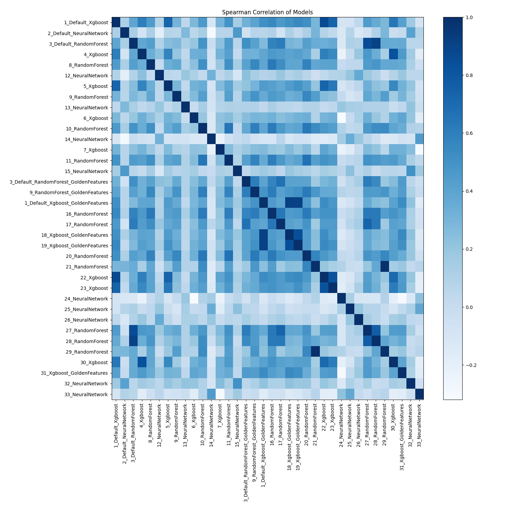

# AutoML Leaderboard

| Best model   | name                                                                                     | model_type     | metric_type   |   metric_value |   train_time |   single_prediction_time |
|:-------------|:-----------------------------------------------------------------------------------------|:---------------|:--------------|---------------:|-------------:|-------------------------:|
|              | [1_Default_Xgboost](1_Default_Xgboost/README.md)                                         | Xgboost        | rmse          |        3.12245 |        10.09 |                   0.1411 |
|              | [2_Default_NeuralNetwork](2_Default_NeuralNetwork/README.md)                             | Neural Network | rmse          |        3.20649 |         2.37 |                   0.1618 |
| **the best** | [3_Default_RandomForest](3_Default_RandomForest/README.md)                               | Random Forest  | rmse          |        3.05718 |        12.29 |                   0.1502 |
|              | [4_Xgboost](4_Xgboost/README.md)                                                         | Xgboost        | rmse          |        3.12932 |        10.15 |                   0.1413 |
|              | [8_RandomForest](8_RandomForest/README.md)                                               | Random Forest  | rmse          |        3.13063 |        12.33 |                   0.1547 |
|              | [12_NeuralNetwork](12_NeuralNetwork/README.md)                                           | Neural Network | rmse          |        3.31075 |         2.52 |                   0.159  |
|              | [5_Xgboost](5_Xgboost/README.md)                                                         | Xgboost        | rmse          |        3.13942 |        10.62 |                   0.1427 |
|              | [9_RandomForest](9_RandomForest/README.md)                                               | Random Forest  | rmse          |        3.11806 |        13.11 |                   0.1563 |
|              | [13_NeuralNetwork](13_NeuralNetwork/README.md)                                           | Neural Network | rmse          |        3.37088 |         2.74 |                   0.16   |
|              | [6_Xgboost](6_Xgboost/README.md)                                                         | Xgboost        | rmse          |        3.13495 |        10.07 |                   0.1426 |
|              | [10_RandomForest](10_RandomForest/README.md)                                             | Random Forest  | rmse          |        3.14972 |        14    |                   0.1627 |
|              | [14_NeuralNetwork](14_NeuralNetwork/README.md)                                           | Neural Network | rmse          |        3.17542 |         2.94 |                   0.1573 |
|              | [7_Xgboost](7_Xgboost/README.md)                                                         | Xgboost        | rmse          |        3.12685 |         9.99 |                   0.1418 |
|              | [11_RandomForest](11_RandomForest/README.md)                                             | Random Forest  | rmse          |        3.13949 |        13.26 |                   0.1562 |
|              | [15_NeuralNetwork](15_NeuralNetwork/README.md)                                           | Neural Network | rmse          |        3.15452 |         2.91 |                   0.1589 |
|              | [3_Default_RandomForest_GoldenFeatures](3_Default_RandomForest_GoldenFeatures/README.md) | Random Forest  | rmse          |        3.12157 |        19.45 |                   0.2339 |
|              | [9_RandomForest_GoldenFeatures](9_RandomForest_GoldenFeatures/README.md)                 | Random Forest  | rmse          |        3.13004 |        19.16 |                   0.2292 |
|              | [1_Default_Xgboost_GoldenFeatures](1_Default_Xgboost_GoldenFeatures/README.md)           | Xgboost        | rmse          |        3.11685 |        12.97 |                   0.2048 |
|              | [16_RandomForest](16_RandomForest/README.md)                                             | Random Forest  | rmse          |        3.1129  |        13.43 |                   0.1576 |
|              | [17_RandomForest](17_RandomForest/README.md)                                             | Random Forest  | rmse          |        3.09569 |        13.37 |                   0.1572 |
|              | [18_Xgboost_GoldenFeatures](18_Xgboost_GoldenFeatures/README.md)                         | Xgboost        | rmse          |        3.11209 |        13.1  |                   0.2028 |
|              | [19_Xgboost_GoldenFeatures](19_Xgboost_GoldenFeatures/README.md)                         | Xgboost        | rmse          |        3.12113 |        13.09 |                   0.2013 |
|              | [20_RandomForest](20_RandomForest/README.md)                                             | Random Forest  | rmse          |        3.12014 |        16.66 |                   0.1818 |
|              | [21_RandomForest](21_RandomForest/README.md)                                             | Random Forest  | rmse          |        3.07005 |        15.06 |                   0.1676 |
|              | [22_Xgboost](22_Xgboost/README.md)                                                       | Xgboost        | rmse          |        3.11629 |        11.11 |                   0.1408 |
|              | [23_Xgboost](23_Xgboost/README.md)                                                       | Xgboost        | rmse          |        3.11107 |        11.08 |                   0.1422 |
|              | [24_NeuralNetwork](24_NeuralNetwork/README.md)                                           | Neural Network | rmse          |        3.187   |         3.36 |                   0.1572 |
|              | [25_NeuralNetwork](25_NeuralNetwork/README.md)                                           | Neural Network | rmse          |        3.23049 |         3.47 |                   0.1592 |
|              | [26_NeuralNetwork](26_NeuralNetwork/README.md)                                           | Neural Network | rmse          |        3.2042  |         3.45 |                   0.1612 |
|              | [27_RandomForest](27_RandomForest/README.md)                                             | Random Forest  | rmse          |        3.08886 |        13.5  |                   0.1534 |
|              | [28_RandomForest](28_RandomForest/README.md)                                             | Random Forest  | rmse          |        3.07386 |        13.52 |                   0.1542 |
|              | [29_RandomForest](29_RandomForest/README.md)                                             | Random Forest  | rmse          |        3.06948 |        15.61 |                   0.1741 |
|              | [30_Xgboost](30_Xgboost/README.md)                                                       | Xgboost        | rmse          |        3.13239 |        11.1  |                   0.1403 |
|              | [31_Xgboost_GoldenFeatures](31_Xgboost_GoldenFeatures/README.md)                         | Xgboost        | rmse          |        3.10353 |        13.49 |                   0.2041 |
|              | [32_NeuralNetwork](32_NeuralNetwork/README.md)                                           | Neural Network | rmse          |        3.29741 |         3.7  |                   0.1577 |
|              | [33_NeuralNetwork](33_NeuralNetwork/README.md)                                           | Neural Network | rmse          |        3.15574 |         3.89 |                   0.1581 |

### AutoML Performance

### AutoML Performance Boxplot

### Features Importance

### Spearman Correlation of Models

