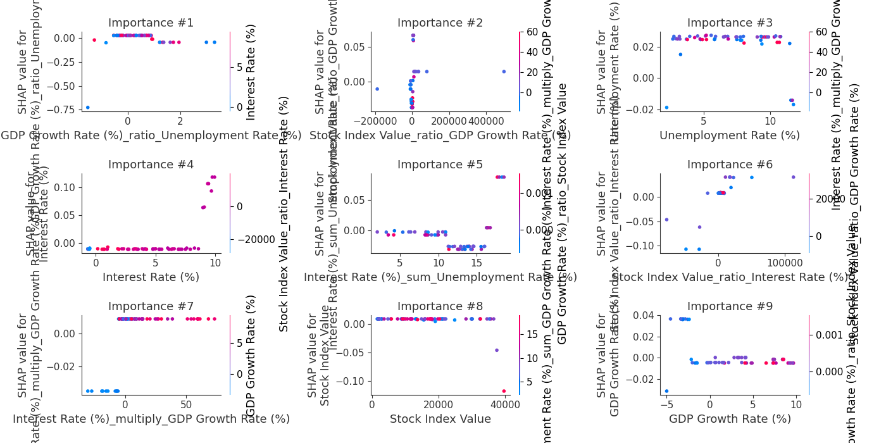
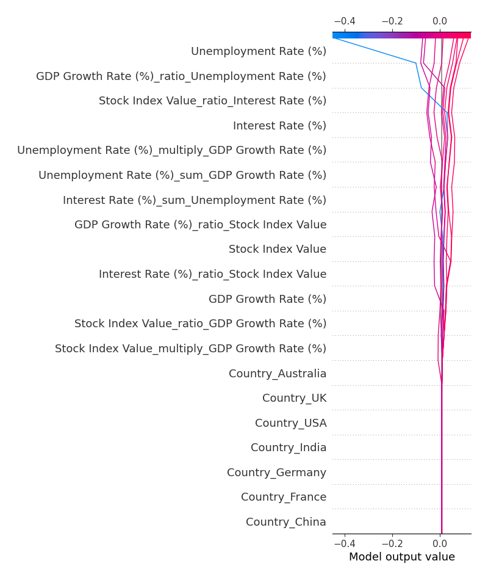
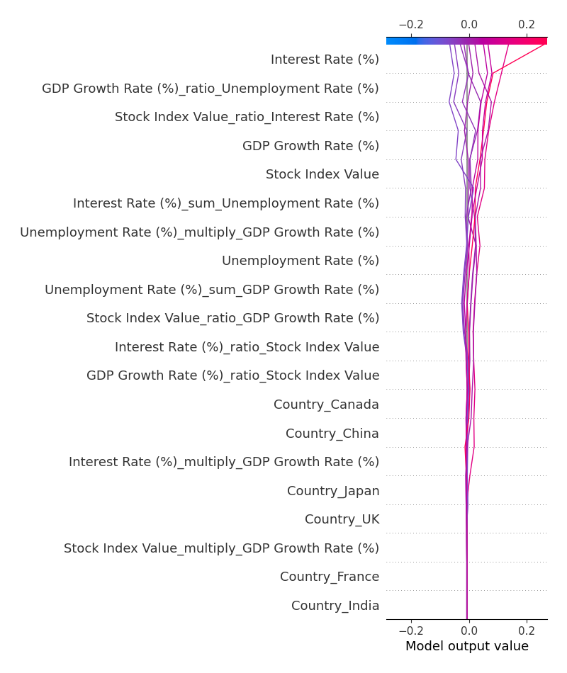

# Summary of 17_RandomForest_GoldenFeatures

[<< Go back](../README.md)

## Random Forest
- **n_jobs**: -1
- **criterion**: squared_error
- **max_features**: 0.6
- **min_samples_split**: 50
- **max_depth**: 3
- **eval_metric_name**: rmse
- **explain_level**: 2

## Validation
 - **validation_type**: kfold
 - **k_folds**: 7
 - **shuffle**: False

## Optimized metric
rmse

## Training time

19.9 seconds

### Metric details:
| Metric   |      Score |
|:---------|-----------:|
| MAE      |  2.64565   |
| MSE      |  9.50302   |
| RMSE     |  3.0827    |
| R2       | -0.0702297 |
| MAPE     |  5.75562   |

## Learning curves

## Permutation-based Importance

## True vs Predicted

## Predicted vs Residuals

## SHAP Importance

## SHAP Dependence plots

### Dependence (Fold 1)

### Dependence (Fold 2)

### Dependence (Fold 3)

### Dependence (Fold 4)

### Dependence (Fold 5)

### Dependence (Fold 6)

### Dependence (Fold 7)

## SHAP Decision plots

### Top-10 Worst decisions (Fold 1)

### Top-10 Worst decisions (Fold 2)

### Top-10 Worst decisions (Fold 3)

### Top-10 Worst decisions (Fold 4)

### Top-10 Worst decisions (Fold 5)

### Top-10 Worst decisions (Fold 6)

### Top-10 Worst decisions (Fold 7)

### Top-10 Best decisions (Fold 1)

### Top-10 Best decisions (Fold 2)

### Top-10 Best decisions (Fold 3)

### Top-10 Best decisions (Fold 4)

### Top-10 Best decisions (Fold 5)

### Top-10 Best decisions (Fold 6)

### Top-10 Best decisions (Fold 7)

[<< Go back](../README.md)
