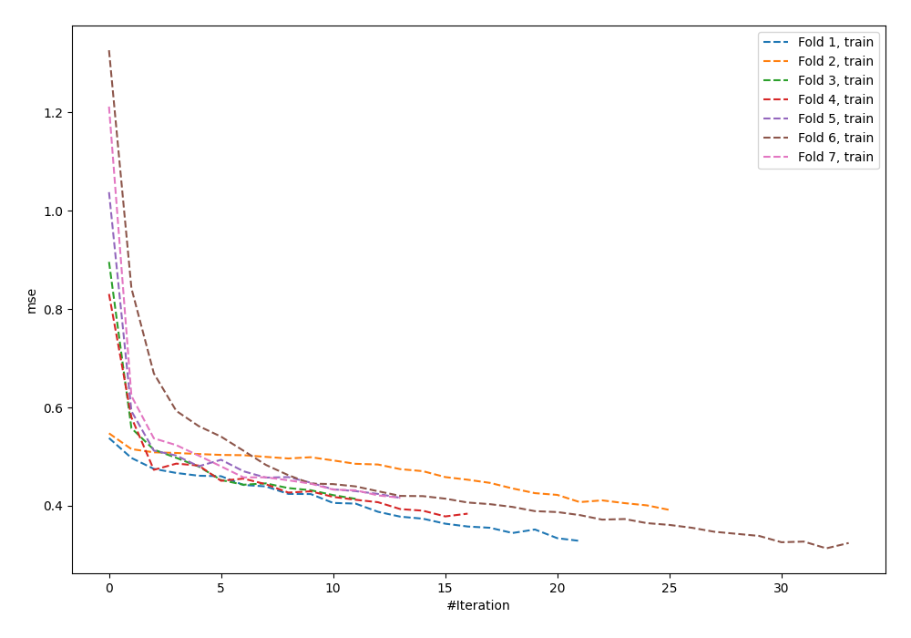
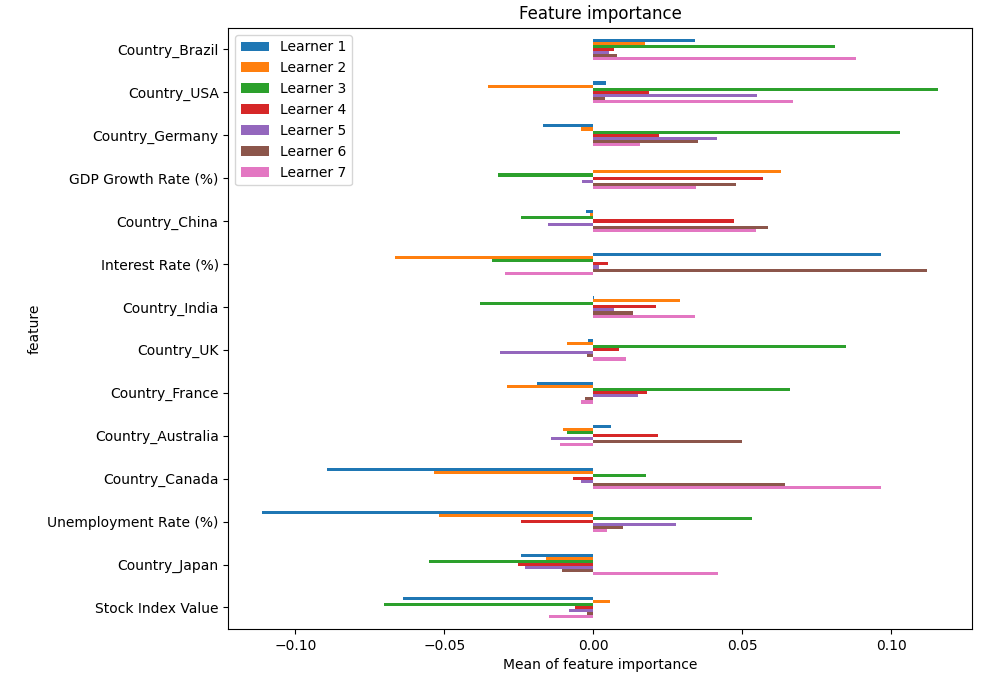
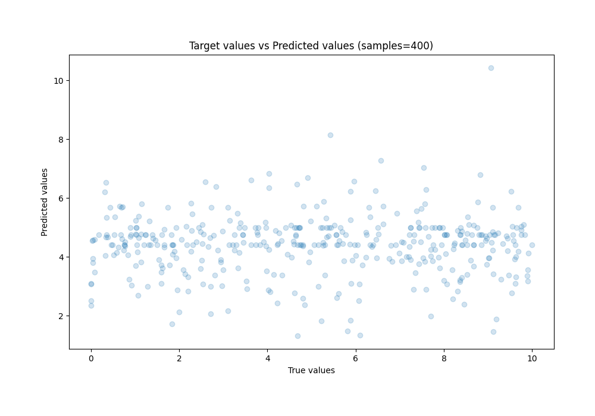
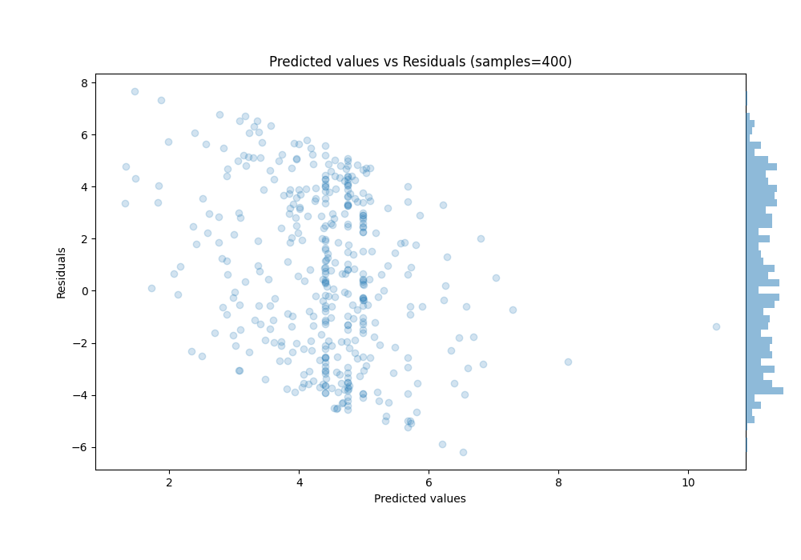

# Summary of 24_NeuralNetwork

[<< Go back](../README.md)

## Neural Network
- **n_jobs**: -1
- **dense_1_size**: 64
- **dense_2_size**: 4
- **learning_rate**: 0.05
- **explain_level**: 2

## Validation
 - **validation_type**: kfold
 - **k_folds**: 7
 - **shuffle**: False

## Optimized metric
rmse

## Training time

3.9 seconds

### Metric details:
| Metric   |     Score |
|:---------|----------:|
| MAE      |  2.73416  |
| MSE      | 10.2439   |
| RMSE     |  3.20062  |
| R2       | -0.153673 |
| MAPE     |  5.17975  |

## Learning curves

## Permutation-based Importance

## True vs Predicted

## Predicted vs Residuals

[<< Go back](../README.md)
