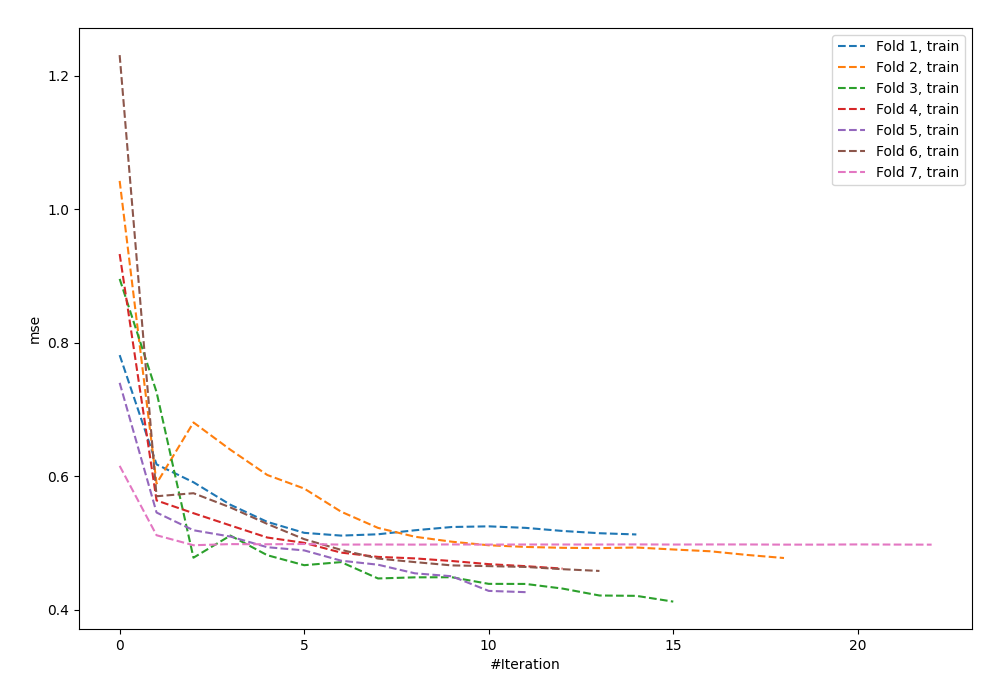
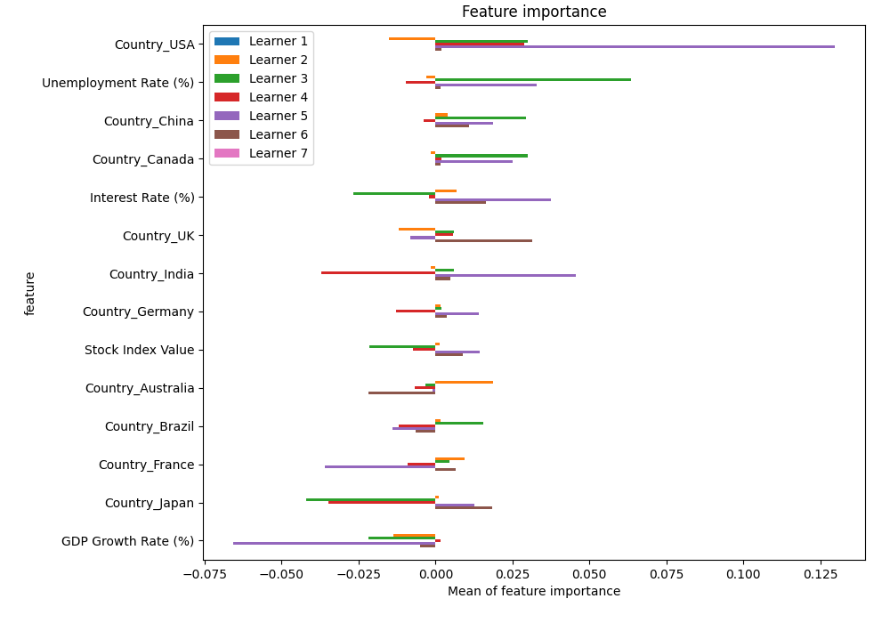
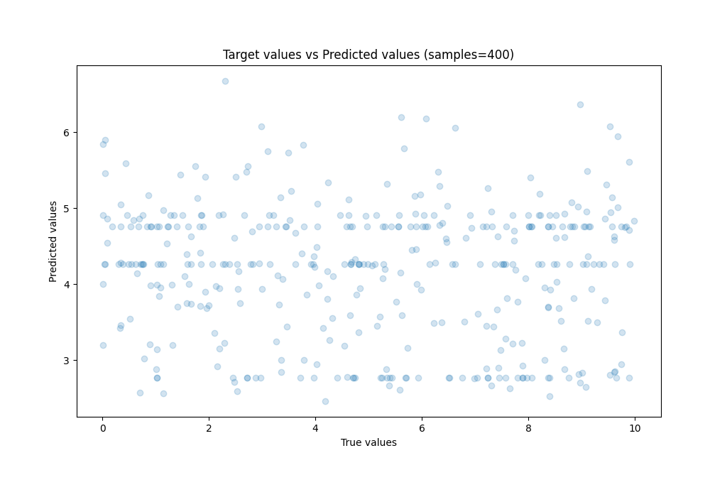
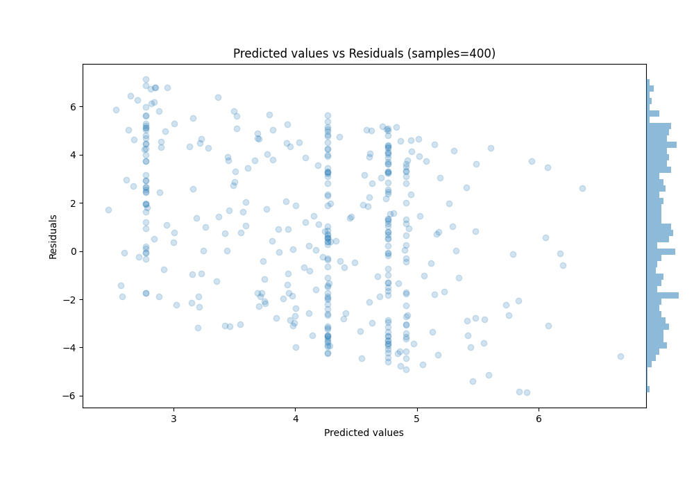

# Summary of 35_NeuralNetwork

[<< Go back](../README.md)

## Neural Network
- **n_jobs**: -1
- **dense_1_size**: 32
- **dense_2_size**: 4
- **learning_rate**: 0.08
- **explain_level**: 2

## Validation
 - **validation_type**: kfold
 - **k_folds**: 7
 - **shuffle**: False

## Optimized metric
rmse

## Training time

4.5 seconds

### Metric details:
| Metric   |     Score |
|:---------|----------:|
| MAE      |  2.80958  |
| MSE      | 10.7486   |
| RMSE     |  3.27851  |
| R2       | -0.210508 |
| MAPE     |  7.01731  |

## Learning curves

## Permutation-based Importance

## True vs Predicted

## Predicted vs Residuals

[<< Go back](../README.md)
