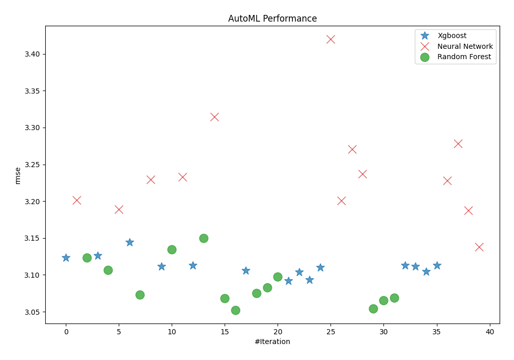
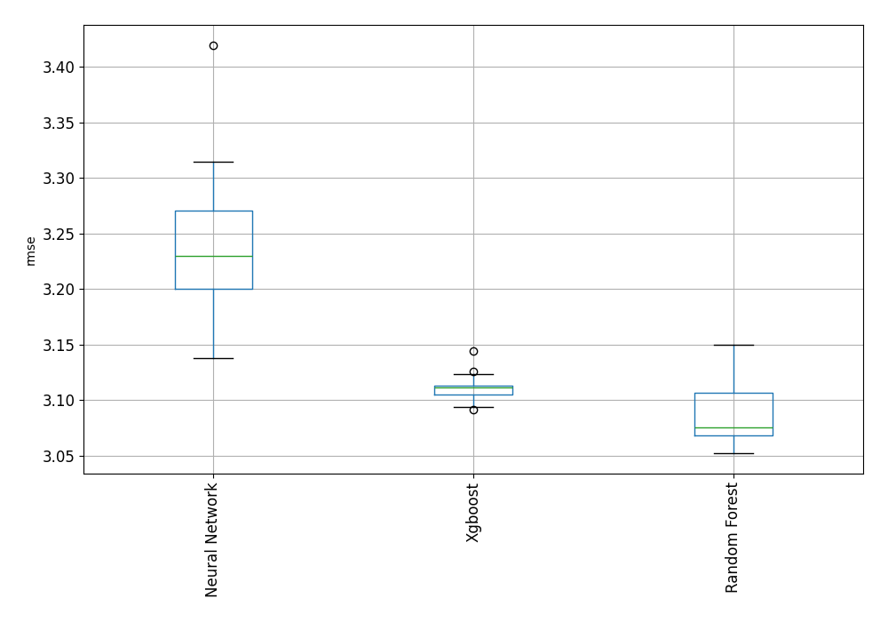
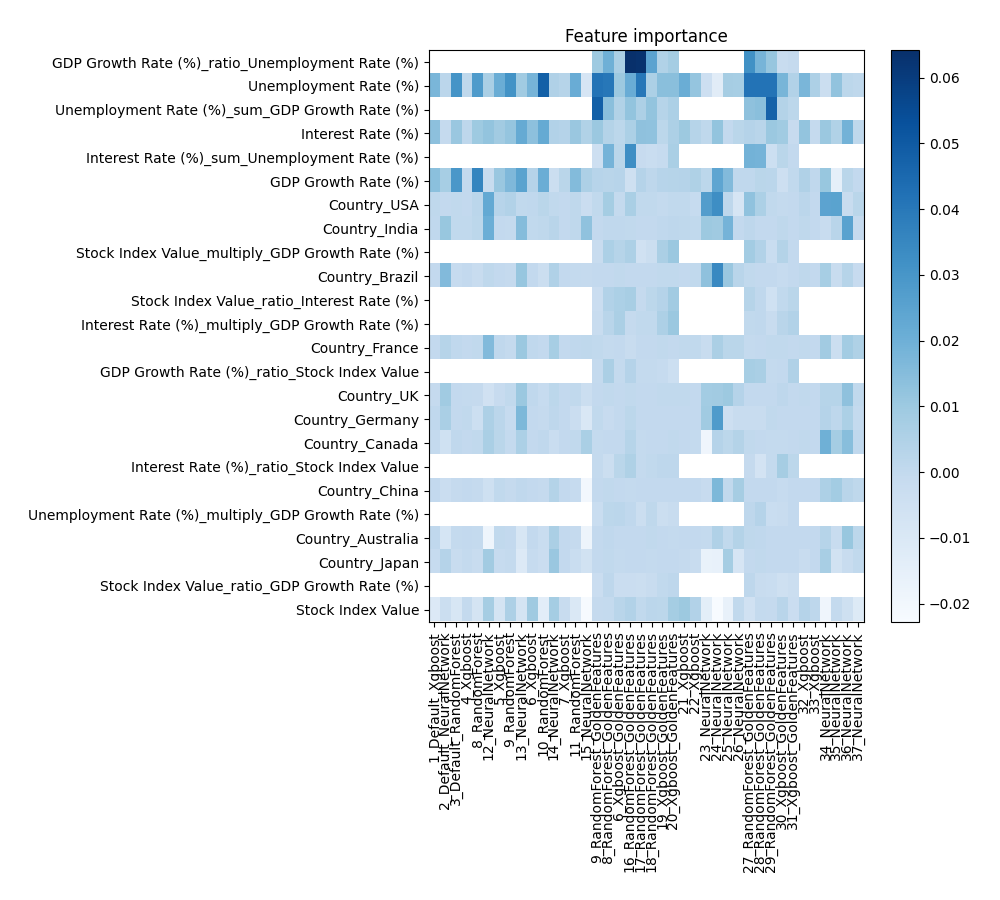
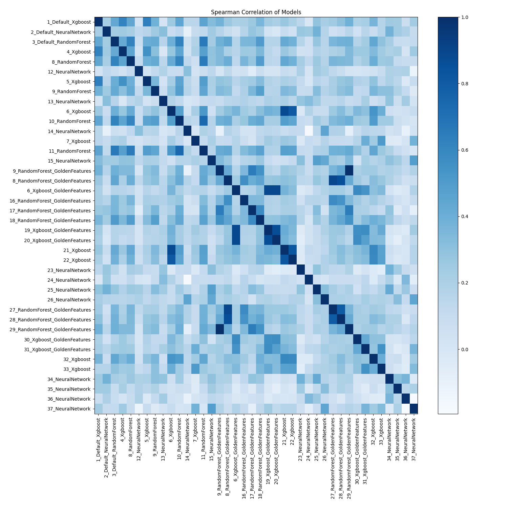

# AutoML Leaderboard

| Best model   | name                                                                       | model_type     | metric_type   |   metric_value |   train_time |   single_prediction_time |
|:-------------|:---------------------------------------------------------------------------|:---------------|:--------------|---------------:|-------------:|-------------------------:|
|              | [1_Default_Xgboost](1_Default_Xgboost/README.md)                           | Xgboost        | rmse          |        3.12333 |        13.92 |                   0.1983 |
|              | [2_Default_NeuralNetwork](2_Default_NeuralNetwork/README.md)               | Neural Network | rmse          |        3.20175 |         3.15 |                   0.2232 |
|              | [3_Default_RandomForest](3_Default_RandomForest/README.md)                 | Random Forest  | rmse          |        3.12369 |        17.9  |                   0.2228 |
|              | [4_Xgboost](4_Xgboost/README.md)                                           | Xgboost        | rmse          |        3.12622 |        13.94 |                   0.197  |
|              | [8_RandomForest](8_RandomForest/README.md)                                 | Random Forest  | rmse          |        3.10653 |        17.78 |                   0.222  |
|              | [12_NeuralNetwork](12_NeuralNetwork/README.md)                             | Neural Network | rmse          |        3.18894 |         3.38 |                   0.2221 |
|              | [5_Xgboost](5_Xgboost/README.md)                                           | Xgboost        | rmse          |        3.14395 |        14.56 |                   0.2009 |
|              | [9_RandomForest](9_RandomForest/README.md)                                 | Random Forest  | rmse          |        3.07275 |        18.26 |                   0.2223 |
|              | [13_NeuralNetwork](13_NeuralNetwork/README.md)                             | Neural Network | rmse          |        3.2297  |         3.6  |                   0.2226 |
|              | [6_Xgboost](6_Xgboost/README.md)                                           | Xgboost        | rmse          |        3.11129 |        14.08 |                   0.2013 |
|              | [10_RandomForest](10_RandomForest/README.md)                               | Random Forest  | rmse          |        3.13422 |        19.79 |                   0.2254 |
|              | [14_NeuralNetwork](14_NeuralNetwork/README.md)                             | Neural Network | rmse          |        3.23313 |         3.8  |                   0.2263 |
|              | [7_Xgboost](7_Xgboost/README.md)                                           | Xgboost        | rmse          |        3.11275 |        13.79 |                   0.202  |
|              | [11_RandomForest](11_RandomForest/README.md)                               | Random Forest  | rmse          |        3.14956 |        19.44 |                   0.2275 |
|              | [15_NeuralNetwork](15_NeuralNetwork/README.md)                             | Neural Network | rmse          |        3.31498 |         3.9  |                   0.2239 |
|              | [9_RandomForest_GoldenFeatures](9_RandomForest_GoldenFeatures/README.md)   | Random Forest  | rmse          |        3.06823 |        22.13 |                   0.3069 |
| **the best** | [8_RandomForest_GoldenFeatures](8_RandomForest_GoldenFeatures/README.md)   | Random Forest  | rmse          |        3.05239 |        22.12 |                   0.3081 |
|              | [6_Xgboost_GoldenFeatures](6_Xgboost_GoldenFeatures/README.md)             | Xgboost        | rmse          |        3.1059  |        17.58 |                   0.2831 |
|              | [16_RandomForest_GoldenFeatures](16_RandomForest_GoldenFeatures/README.md) | Random Forest  | rmse          |        3.07509 |        21.53 |                   0.2962 |
|              | [17_RandomForest_GoldenFeatures](17_RandomForest_GoldenFeatures/README.md) | Random Forest  | rmse          |        3.0827  |        21.09 |                   0.2982 |
|              | [18_RandomForest_GoldenFeatures](18_RandomForest_GoldenFeatures/README.md) | Random Forest  | rmse          |        3.09756 |        21.11 |                   0.2998 |
|              | [19_Xgboost_GoldenFeatures](19_Xgboost_GoldenFeatures/README.md)           | Xgboost        | rmse          |        3.09176 |        17.53 |                   0.2874 |
|              | [20_Xgboost_GoldenFeatures](20_Xgboost_GoldenFeatures/README.md)           | Xgboost        | rmse          |        3.10358 |        17.65 |                   0.2862 |
|              | [21_Xgboost](21_Xgboost/README.md)                                         | Xgboost        | rmse          |        3.09362 |        14.92 |                   0.1993 |
|              | [22_Xgboost](22_Xgboost/README.md)                                         | Xgboost        | rmse          |        3.11039 |        14.84 |                   0.1997 |
|              | [23_NeuralNetwork](23_NeuralNetwork/README.md)                             | Neural Network | rmse          |        3.41978 |         4.45 |                   0.2227 |
|              | [24_NeuralNetwork](24_NeuralNetwork/README.md)                             | Neural Network | rmse          |        3.20062 |         4.5  |                   0.2239 |
|              | [25_NeuralNetwork](25_NeuralNetwork/README.md)                             | Neural Network | rmse          |        3.27071 |         4.5  |                   0.2234 |
|              | [26_NeuralNetwork](26_NeuralNetwork/README.md)                             | Neural Network | rmse          |        3.23705 |         4.64 |                   0.224  |
|              | [27_RandomForest_GoldenFeatures](27_RandomForest_GoldenFeatures/README.md) | Random Forest  | rmse          |        3.0545  |        21.99 |                   0.3019 |
|              | [28_RandomForest_GoldenFeatures](28_RandomForest_GoldenFeatures/README.md) | Random Forest  | rmse          |        3.06574 |        21.68 |                   0.2952 |
|              | [29_RandomForest_GoldenFeatures](29_RandomForest_GoldenFeatures/README.md) | Random Forest  | rmse          |        3.0692  |        22.78 |                   0.3018 |
|              | [30_Xgboost_GoldenFeatures](30_Xgboost_GoldenFeatures/README.md)           | Xgboost        | rmse          |        3.1129  |        18.41 |                   0.2831 |
|              | [31_Xgboost_GoldenFeatures](31_Xgboost_GoldenFeatures/README.md)           | Xgboost        | rmse          |        3.11181 |        17.54 |                   0.2831 |
|              | [32_Xgboost](32_Xgboost/README.md)                                         | Xgboost        | rmse          |        3.10428 |        15.53 |                   0.203  |
|              | [33_Xgboost](33_Xgboost/README.md)                                         | Xgboost        | rmse          |        3.11267 |        15.25 |                   0.2032 |
|              | [34_NeuralNetwork](34_NeuralNetwork/README.md)                             | Neural Network | rmse          |        3.22828 |         5.07 |                   0.2246 |
|              | [35_NeuralNetwork](35_NeuralNetwork/README.md)                             | Neural Network | rmse          |        3.27851 |         5.08 |                   0.2239 |
|              | [36_NeuralNetwork](36_NeuralNetwork/README.md)                             | Neural Network | rmse          |        3.18776 |         5.1  |                   0.2228 |
|              | [37_NeuralNetwork](37_NeuralNetwork/README.md)                             | Neural Network | rmse          |        3.1379  |         5.19 |                   0.2237 |

### AutoML Performance

### AutoML Performance Boxplot

### Features Importance

### Spearman Correlation of Models

